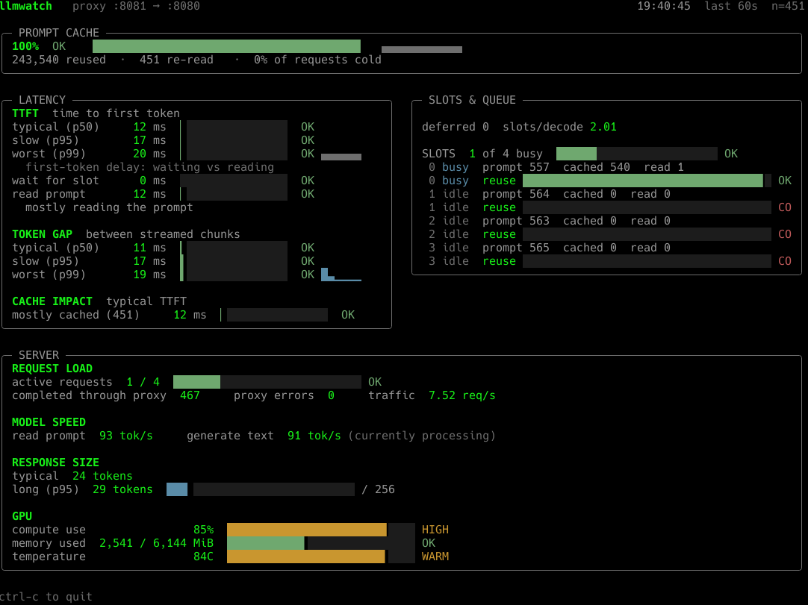

# llama-watch

`llama-watch` is a terminal dashboard and transparent reverse proxy for a
local [llama.cpp](https://github.com/ggml-org/llama.cpp) server. It shows
request-level prompt-cache reuse, time-to-first-token, inter-token stalls,
response size, slot state, server speed, and NVIDIA GPU state.

It fills in measurements that `/metrics` alone cannot provide: cache reuse and
latency are measured from requests as they pass through the proxy.

## What it looks like



The same run, as plain text:

```
llmwatch   proxy :8081 → :8080                                          19:40:45  last 60s  n=451

╭─ PROMPT CACHE ──────────────────────────────────────────────────────────────────────────────────╮
│ 100%  OK   ████████████████████████████████████████                                             │
│ 243,540 reused  ·  451 re-read   ·  0% of requests cold                                          │
╰────────────────────────────────────────────────────────────────────────────────────────────────╯

╭─ LATENCY ─────────────────────────────────────╮  ╭─ SLOTS & QUEUE ─────────────────────────────╮
│ TTFT  time to first token                      │  │ deferred 0   slots/decode 2.01              │
│ typical (p50)     12 ms  ▏                OK   │  │                                              │
│ slow (p95)        17 ms  ▏                OK   │  │ SLOTS  1 of 4 busy  ████░░░░░░░░░░░░░░  OK   │
│ worst (p99)       20 ms  ▎                OK   │  │  0 busy  prompt 557  cached 540  read 1      │
│   first-token delay: waiting vs reading        │  │  0 busy  reuse ████████████████████▊░  OK    │
│ wait for slot      0 ms                   OK   │  │  1 idle  prompt 564  cached 0  read 0        │
│ read prompt       12 ms  ▏                OK   │  │  1 idle  reuse                        COLD   │
│   mostly reading the prompt                    │  │  2 idle  prompt 563  cached 0  read 0        │
│                                                 │  │  2 idle  reuse                        COLD   │
│ TOKEN GAP  between streamed chunks             │  │  3 idle  prompt 565  cached 0  read 0        │
│ typical (p50)     11 ms  ▏                OK   │  │  3 idle  reuse                        COLD   │
│ slow (p95)        17 ms  ▏                OK   │  ╰──────────────────────────────────────────────╯
│ worst (p99)       19 ms  ▎             ▁▂▇  OK │
│                                                 │
│ CACHE IMPACT  typical TTFT                     │
│ mostly cached (451)  12 ms  ▏             OK   │
╰─────────────────────────────────────────────────╯

╭─ SERVER ───────────────────────────────────────────────────────────────────────────────────────╮
│ REQUEST LOAD                                                                                    │
│ active requests  1 / 4  ████████░░░░░░░░░░░░░░░░░░░░░░░░  OK                                    │
│ completed through proxy  467     proxy errors  0     traffic  7.52 req/s                        │
│                                                                                                  │
│ MODEL SPEED                                                                                     │
│ read prompt  93 tok/s     generate text  91 tok/s (currently processing)                        │
│                                                                                                  │
│ RESPONSE SIZE                                                                                   │
│ typical  24 tokens                                                                              │
│ long (p95)  29 tokens  ██░░░░░░░░░░░░░░░░░░░░░░░░░░  / 256                                       │
│                                                                                                  │
│ GPU                                                                                             │
│ compute use                 85%  ██████████████████████████████████░░░░░░  HIGH                 │
│ memory used  2,541 / 6,144 MiB  █████████████░░░░░░░░░░░░░░░░░░░░░░░░░░░░  OK                   │
│ temperature                 84C  ███████████████████████████████████░░░░░  WARM                 │
╰───────────────────────────────────────────────────────────────────────────────────────────────╯

ctrl-c to quit
```

In a real terminal the meters, `OK`/`SLOW`/`HIGH`/`COLD` labels, and sparklines are
colored (green/amber/red), never color alone -- every state also carries a text
label, so it degrades cleanly with `--ascii --no-color` too.

## Requirements

- Python 3.9 or newer
- A running llama.cpp `llama-server` with `--metrics`; `--slots` is strongly
  recommended.
- No Python runtime dependencies.
- `nvidia-smi` on `PATH` is optional and enables the GPU panel.

## Install

From a checkout, for an isolated command-line install:

```bash
pipx install .
```

For development from a checkout:

```bash
python -m pip install -e .
```

## Quick start

Start llama.cpp on loopback, with metrics and slots enabled:

```bash
llama-server -m model.gguf --metrics --slots -np 4 -c 8192 --host 127.0.0.1 --port 8080
```

In a second terminal, start the dashboard and proxy:

```bash
llama-watch --upstream-host 127.0.0.1 --upstream-port 8080 --listen 8081
```

Point the client that normally calls `http://127.0.0.1:8080` to
`http://127.0.0.1:8081` instead. Requests are forwarded unchanged; generation
requests are observed as their response streams through.

## Proxy and security model

Both the upstream and proxy listener default to `127.0.0.1`. This is the safe
configuration for a local model server: llama-watch does not implement
authentication, TLS, or access control.

To make the proxy reachable from another machine, put an authenticated TLS
reverse proxy in front of it, or explicitly choose a bind address only on a
trusted private network:

```bash
llama-watch --listen-host 192.168.1.20 --listen 8081
```

The proxy preserves streaming responses and uses HTTP/1.1 chunked transfer
encoding downstream. It removes hop-by-hop headers and generates its own
transfer framing, avoiding conflicting upstream `Content-Length` headers.

## Exporting what llama-watch sees

The rolling window behind the dashboard holds at most 500 requests and lives
only in memory. Two options carry it further:

```bash
# Append one JSON object per completed request (ttft, itl, cache_n, prompt_n,
# queue_ms, stop_type, ...) to a file, for after-the-fact analysis.
llama-watch --log requests.jsonl

# Scrape the derived numbers llama.cpp's own /metrics cannot give you --
# cache hit ratio, TTFT/inter-token-gap percentiles, the queue-vs-prefill
# split -- as Prometheus exposition text.
curl http://127.0.0.1:8081/llmwatch/metrics
```

`/llmwatch/metrics` is answered directly by the proxy (it is never forwarded
upstream, so it can't collide with anything llama.cpp itself exposes) and
reflects the same `--window` the dashboard uses. It is not counted as proxied
traffic.

## Useful commands

```bash
# Inspect exactly what this llama.cpp build exposes.
llama-watch --debug

# Run only the display/collectors; do not accept client requests.
llama-watch --no-proxy

# Friendly output for basic terminals or logs.
llama-watch --ascii --no-color
```

Use `llama-watch --help` for all options. From an uninstalled checkout, run
`PYTHONPATH=src python -m llamawatch`.

## Development

```bash
python -m unittest discover -s tests -v
```

The included end-to-end test starts a mock llama.cpp server, sends both
streaming and non-streaming requests through the proxy, and verifies that the
dashboard renders request metrics.
